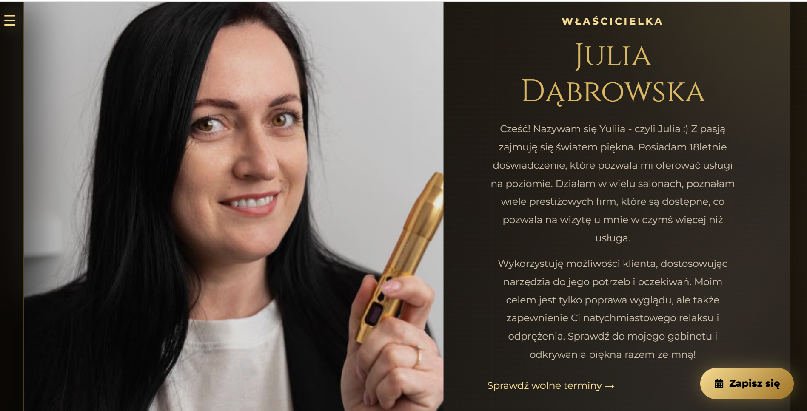
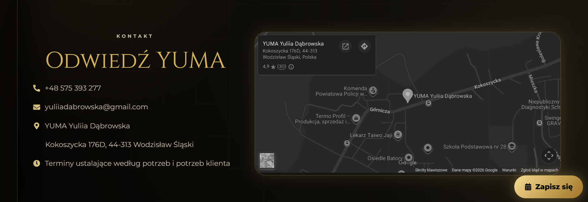

<div align="center">

# YUMA Beauty Salon Website

Modern luxury beauty salon website built with React, Vite and JavaScript.

[Live Website](https://yuma-srnz.vercel.app/) • [Source Code](https://github.com/dianashtykh08-droid/YUMA)

<br>


</div>

---

## About

YUMA is a modern website created for a real beauty salon.

The project focuses on elegant design, responsive layout and smooth user experience while allowing customers to explore services, browse the gallery and book appointments through Booksy.

---

## Features

- Responsive design
- Luxury user interface
- Service search
- Gallery
- Customer reviews
- Google Maps integration
- Booksy booking
- Social media integration

---

## Technologies

- React
- Vite
- JavaScript (ES6)
- HTML5
- CSS3
- React Icons

---

# Preview




---

# Gallery

| Home | Services |
|------|----------|
|  |  |

| Gallery | Contact |
|---------|----------|
|  |  |

---

## Live Demo

http://yuma-beauty.pl/

---

## Installation

```bash
npm install
npm run dev
```

---

## Build

```bash
npm run build
```

---

## Author

Diana Shtykh

GitHub:
https://github.com/dianashtykh08-droid

